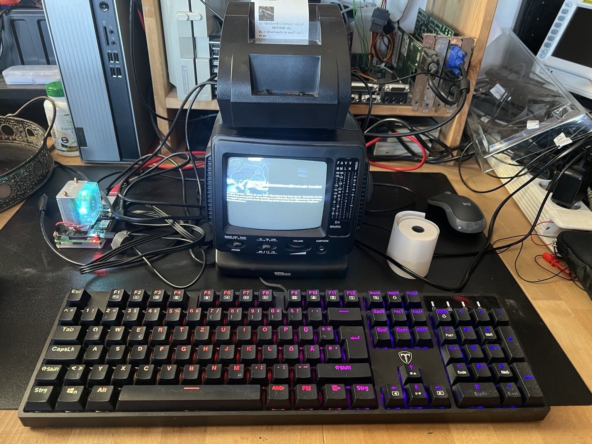
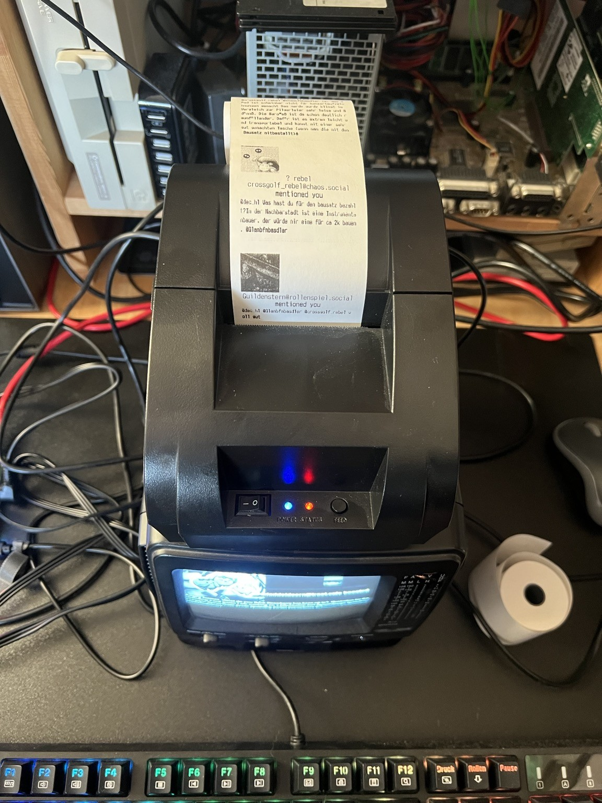
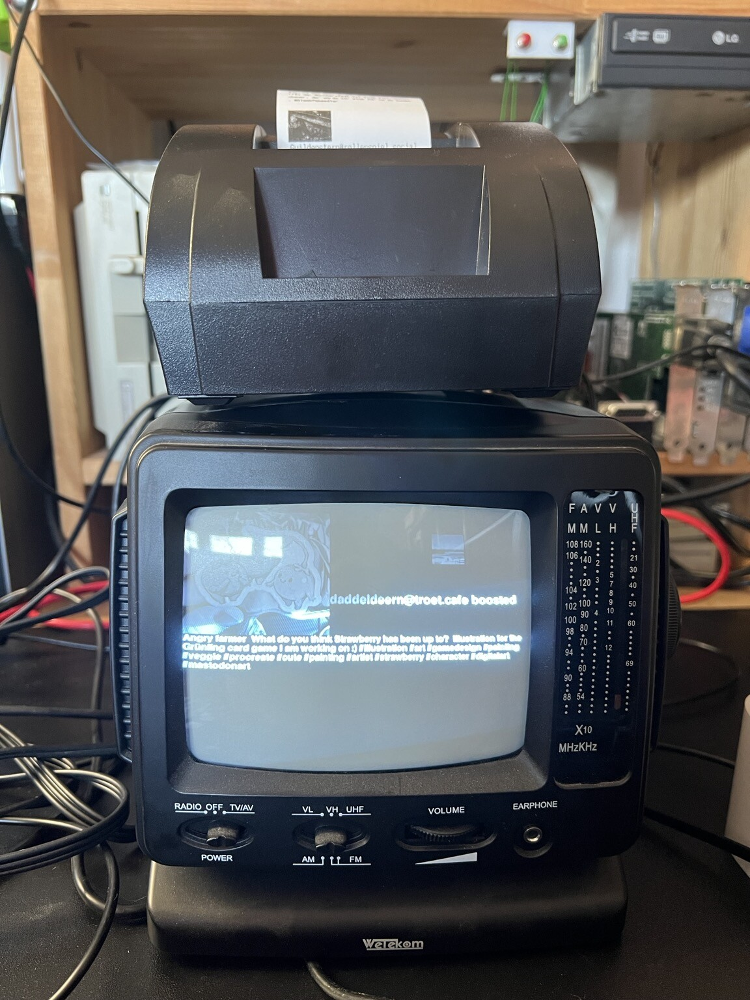
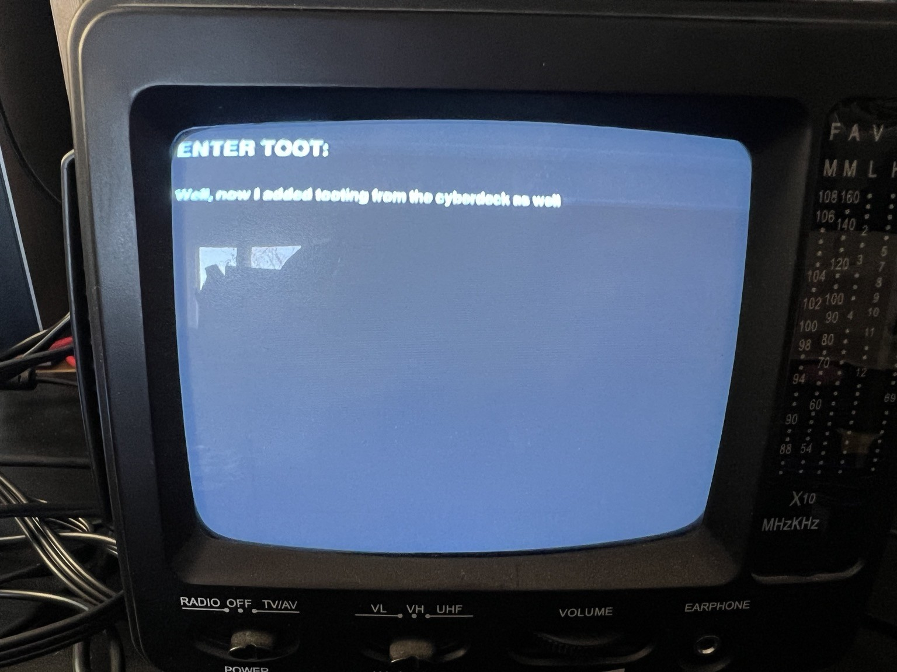

# Introduction
This is a small fun project I did when switching from Twitter to Mastodon. It is a minimal Mastodon client with a twist. I hooked a b/w CRT TV to a Raspberry and added a thermal receipt printer ([POS-5890](https://www.google.com/search?client=firefox-b-d&q=POS-5890)).
The TV shows the latest toot from the home timeline and the printer creates a continuous flow of paper for all notifications.







# Installation
PyToDon needs Python3, the PIL image library, [python-escpos](https://github.com/python-escpos/python-escpos.git), Mastodon.py and pygame.

For example (incomplete, you might need to install additional packages):
```
sudo apt-get install python3 python3-pil 
pip3 install Mastodon.py pygame
```

# Running
You may need to change the server address in `PyToDon.py`:
```
[...]
import pygame

MASTODON_SERVER = "https://mastodon.social"

CHECK_DELAY = 10
[...]
```

After that you need to register the client ONCE:
```
python3 mytest.py login
```

Then you can login using your credentials:
```
python3 mytest.py login <user> <password>
```

After that you can simply start the client using:
```
python3 mytest.py run
```
